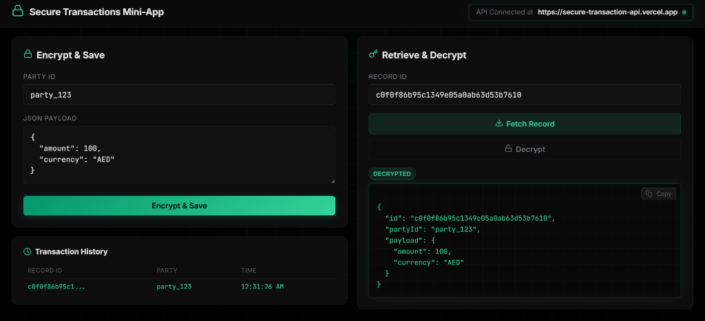
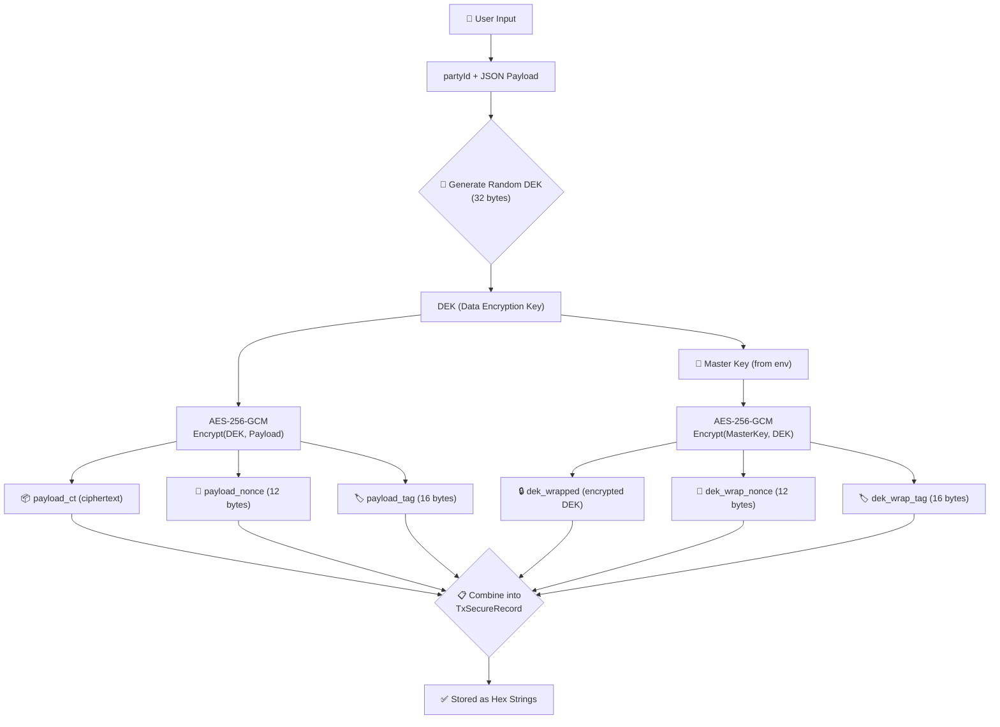

# 🔐 Secure Transactions Mini-App

A TurboRepo monorepo implementing a secure transaction service with **Envelope Encryption (AES-256-GCM)**.

## 🌐 Live Demo

| App | URL |
|-----|-----|
| **Web** | [secure-transaction-web.vercel.app](https://secure-transaction-web.vercel.app/) |
| **API** | [secure-transaction-api.vercel.app](https://secure-transaction-api.vercel.app) |

## 📸 Screenshot



## 🔐 Encryption Flow



## 📁 Project Structure

```
secure-tx/
├── apps/
│   ├── api/          → Fastify backend (POST encrypt, GET fetch, POST decrypt)
│   └── web/          → Next.js frontend (single-page UI)
├── packages/
│   └── crypto/       → Shared encryption logic (AES-256-GCM envelope encryption)
├── turbo.json
├── pnpm-workspace.yaml
└── package.json
```

## 🚀 Getting Started

### Prerequisites
- **Node.js 20+**
- **pnpm** (`npm install -g pnpm`)

### Install & Run

```bash
pnpm install
pnpm dev
```

This starts:
- **Web** → http://localhost:3000
- **API** → http://localhost:3001

### Environment Variables

Copy `.env.example` to `.env` and set values:

```bash
MASTER_KEY=<64 hex chars>                  # 32-byte master key
NEXT_PUBLIC_API_URL=http://localhost:3001   # API URL for frontend
```

If `MASTER_KEY` is not set, a random one is generated on each API restart.

## 🔐 How Encryption Works

This app uses **Envelope Encryption**:

1. Generate random **DEK** (Data Encryption Key, 32 bytes)
2. **Encrypt payload** with DEK using AES-256-GCM
3. **Wrap DEK** with Master Key using AES-256-GCM
4. Store everything as hex strings

## 📡 API Endpoints

| Method | Endpoint | Description |
|--------|----------|-------------|
| `POST` | `/tx/encrypt` | Encrypt & store a payload |
| `GET` | `/tx/:id` | Retrieve encrypted record |
| `POST` | `/tx/:id/decrypt` | Decrypt a stored record |

### Example: Encrypt
```json
POST /tx/encrypt
{
  "partyId": "party_123",
  "payload": { "amount": 100, "currency": "AED" }
}
```

## 🧪 Tests

```bash
cd packages/crypto
pnpm test
```

## 🚀 Deployment

Both apps are deployed to **Vercel**:

| App | Root Directory | Framework |
|-----|---------------|-----------|
| Web | `apps/web` | Next.js |
| API | `apps/api` | Serverless (Node.js) |

Set `MASTER_KEY` and `NEXT_PUBLIC_API_URL` as environment variables in Vercel dashboard.
